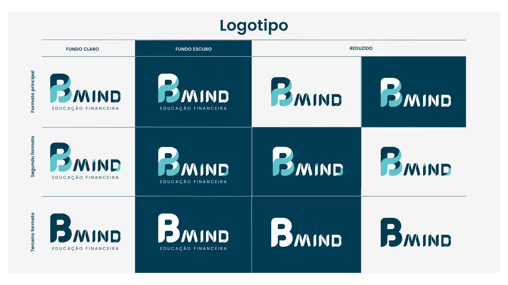
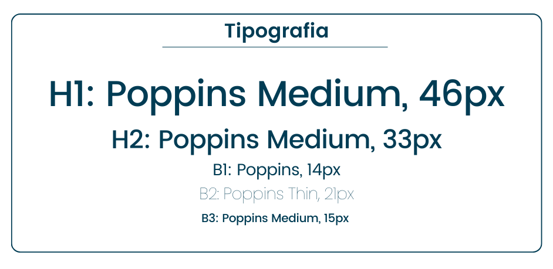

# Template padrão da Aplicação

O layout padrão do site (HTML e CSS) que será utilizado em todas as páginas, em correspondência ao projeto de Interface elaborado anteriormente, conforme imagem abaixo (figura 1) é formado por uma área de cabeçalho e uma área principal central. Foi desenvolvido com ênfase na identidade visual, responsividade e iconografia, proporcionando uma experiência visual agradável em todos os dispositivos.

*Figura 1 - refere-se ao layout do template padrão do site*

## Logotipo Oficial

  

## Variações do logotipo

  

## Paleta de cores

  

## Tipografia utilizada

  

## Homepage (Logado e não Logado)

  
  

## Login

  

## Redefinição de senha

  
  

## Cadastro

  

## Validação de dados

  

## Perfil

  

## Resultado de Pesquisa

  

## Feedback

  

## Conteúdo Didático

  

